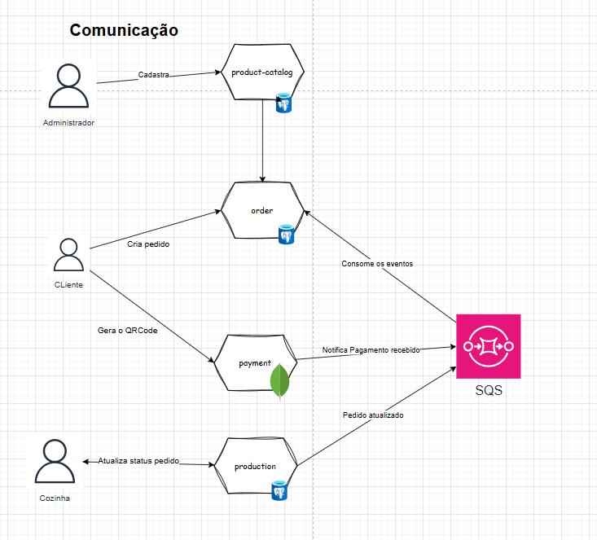
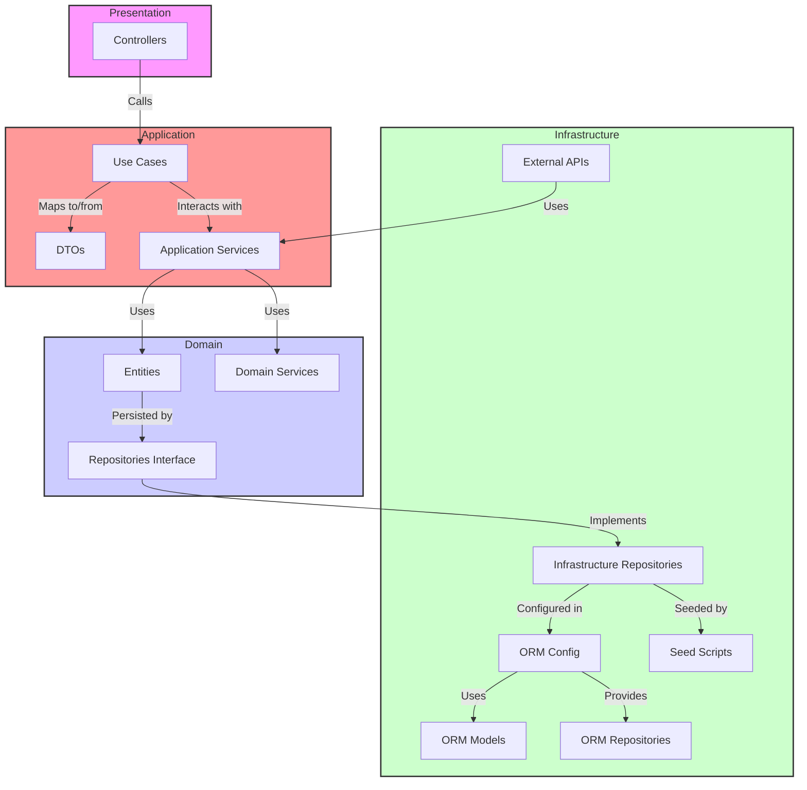

# Tech Challenge (Software Architecture)

Tech Challenge é o projeto do MBA em Software Architecture que engloba os conhecimentos obtidos nas disciplinas.

## O Problema

Há uma lanchonete de bairro que está expandindo devido seu grande sucesso. Porém, com a expansão e sem um sistema de controle de pedidos, o atendimento aos clientes pode ser caótico e confuso. Por exemplo, imagine que um cliente faça um pedido complexo, como um hambúrguer personalizado com ingredientes específicos, acompanhado de batatas fritas e uma bebida. O atendente pode anotar o pedido em um papel e entregá-lo à cozinha, mas não há garantia de que o pedido será preparado corretamente.

Sem um sistema de controle de pedidos, pode haver confusão entre os atendentes e a cozinha, resultando em atrasos na preparação e entrega dos pedidos. Os pedidos podem ser perdidos, mal interpretados ou esquecidos, levando à insatisfação dos clientes e a perda de negócios.

Em resumo, um sistema de controle de pedidos é essencial para garantir que a lanchonete possa atender os clientes de maneira eficiente, gerenciando seus pedidos e estoques de forma adequada. Sem ele, expandir a lanchonete pode acabar não dando certo, resultando em clientes insatisfeitos e impactando os negócios de forma negativa.

## Tabela de conteúdos

- [Tech Challenge - Software Architecture](#tech-challenge-software-architecture)
  - [O Problema](#o-problema)
  - [Event Storm](#event-storm)
    - [📄 Fase 1](../docs/Fase%201.pdf)
    - [📄 Fase 2](../docs/Fase%202.pdf)
    - [📄 Fase 3](../docs/Fase%203.pdf)
    - [📄 Fase 4](../docs/Fase%204.pdf)
  - [Arquitetura](#arquitetura)
  - [Estrutura de Pastas](#estrutura-de-pastas)
  - [Descrição das Pastas e Arquivos](#descrição-das-pastas-e-arquivos)
  - [Diagrama de Arquitetura Limpa](#diagrama-de-arquitetura-limpa)
  - [Documentação do Banco de Dados](#documentação-do-banco-de-dados)
  - [Diagrama do Banco de Dados](#diagrama-do-banco-de-dados)
  - [Detalhes Adicionais](#detalhes-adicionais)
  - [Decisão de Arquitetura do Banco de dados](https://github.com/Grupo-26-FIAP/.github/wiki/Decis%C3%A3o-de-Arquitetura-do-Banco-de-dados)
  - [Como Executar o Projeto](#como-executar-o-projeto)
  - [Membros](#membros)

## Event Storm

O **Event Storm** é uma técnica valiosa utilizada para explorar e mapear o domínio do problema antes de começar o desenvolvimento. Ele ajuda a entender melhor os processos e eventos que ocorrem no sistema, facilitando a modelagem e a estruturação da arquitetura do software.

Para obter uma visão detalhada do Event Storm aplicado a este projeto, incluindo o diagrama visual que foi utilizado para guiar o desenvolvimento, você pode acessar o link abaixo:

<a href="https://miro.com/app/board/uXjVKztqeIc=/?share_link_id=808693294741">
    
</a>

## Arquitetura




## Estrutura de Pastas

Este documento descreve a estrutura de pastas da aplicação baseada na Clean Architecture. Essa organização visa garantir uma separação clara de responsabilidades entre as diferentes camadas do sistema, facilitando a manutenção e evolução da aplicação.

```
src/
├── domain/
│   ├── entities/
│   ├── value-objects/
│   ├── services/
│   └── repositories/
│
├── application/
│   ├── use-cases/
│   ├── dtos/
│   └── mappers/
│
├── infrastructure/
│   ├── orm/
│   ├── repositories/
│   └── config/
│
├── presentation/
│   └── controllers/
│
└── main.ts
```

## Descrição das Pastas e Arquivos

### `src/domain/`

- **`entities/`**: Contém as entidades do domínio, que representam os modelos principais do sistema.
- **`value-objects/`**: Contém os Objetos de Valor do domínio, que são objetos imutáveis utilizados em conjunto com as entidades.
- **`services/`**: Contém serviços que implementam as regras de negócio puras do domínio, sem depender de detalhes de infraestrutura.
- **`repositories/`**: Contém interfaces para repositórios, que são portas de saída para a persistência de dados.

### `src/application/`

- **`use-cases/`**: Contém casos de uso da aplicação, que definem as operações específicas que a aplicação pode realizar e coordenam as interações entre entidades e serviços.
- **`dtos/`**: Contém Data Transfer Objects, que são utilizados para transferir dados entre diferentes camadas da aplicação.
- **`mappers/`**: Contém mapeamentos entre entidades e DTOs para facilitar a conversão de dados entre o formato de persistência e o formato de apresentação.

### `src/presentation/`

- **`controllers/`**: Contém adaptadores de entrada, como controladores HTTP, que recebem as requisições dos clientes e invocam os casos de uso apropriados.

### `src/infrastructure/`

- **`typeorm/`**: Contém configurações e implementações específicas do ORM (TypeORM), como conexões com o banco de dados e definições de entidades.
- **`repositories/`**: Contém a implementação concreta dos repositórios definidos no domínio.
- **`services/`**: Contém serviços de infraestrutura que oferecem funcionalidades auxiliares para a aplicação, como serviços de cache ou de mensageria.
- **`config/`**: Contém configurações da aplicação, como variáveis de ambiente e configurações específicas do sistema.

### `src/shared/`

- **`shared/`**: Contém código e configurações compartilhadas que são usadas em várias partes da aplicação, como utilitários comuns e configurações globais.

### `src/main.ts`

- **`main.ts`**: Ponto de entrada da aplicação. Configura e inicializa o módulo principal do NestJS e inicia o servidor.

## Diagrama de Arquitetura Limpa

O diagrama abaixo ilustra a interação entre as diferentes camadas e componentes da arquitetura limpa do projeto. Esta arquitetura é projetada para promover uma separação clara entre as diferentes responsabilidades do sistema, facilitando a manutenção e evolução da aplicação.



## Como Executar o Projeto

1. **Clone o repositório** (se ainda não o fez):

```bash
git clone https://github.com/diname/tech-challenge-fiap
cd tech-challenge-fiap
```

### Utilizando Docker

Para executar o projeto utilizando Docker, siga os passos abaixo:

1. **Certifique-se de que o Docker e o Docker Compose estão instalados**:

   - [Docker](https://www.docker.com/get-started)
   - [Docker Compose](https://docs.docker.com/compose/install/)

2. **Inicie os Contêineres com Docker Compose**:

Utilize o docker-compose.yml para iniciar a aplicação e os serviços dependentes (como o banco de dados):

```bash
docker compose up
```

Isso iniciará todos os serviços definidos no **docker-compose.yml**. Você verá os logs da aplicação no terminal.

### **Acessando o Swagger**

Após iniciar os contêineres, o Swagger estará acessível em [http://localhost:3000/docs](http://localhost:3000/docs) (ou a porta definida no docker-compose.yml).

> ⚠️ **Atenção**
>
> [Instruções de fluxo](https://github.com/Grupo-26-FIAP/.github/wiki/Fluxo-de-teste)

## Membros

| Nome                           | RM           | E-mail                                                             | GitHub                                             |
| ------------------------------ | ------------ | ------------------------------------------------------------------ | -------------------------------------------------- |
| Jhoni Farias                   | **RM357358** | [jhonifarias.developer@gmail.com](jhonifarias.developer@gmail.com) | [@JhoniFarias](https://github.com/JhoniFarias)     |
| Josef Henrique Zambreti        | **RM357836** | [josefhenrique@uol.com.br](josefhenrique@uol.com.br)               | [@Josefhz](https://github.com/Josefhz)             |
| Lucas Rodrigues Medina Costa   | **RM357360** | [lucasmedinarmc@gmail.com](lucasmedinarmc@gmail.com)               | [@diname](https://github.com/diname)               |
| Kleber de Oliveira Andrade     | **RM358012** | [pdjkleber@gmail.com](pdjkleber@gmail.com)                         | [@kleberandrade](https://github.com/kleberandrade) |
| Vitória Camila Xavier Sobrinho | **RM357235** | [vcamilaxs@gmail.com](vcamilaxs@gmail.com)                         | [@itsvickie](https://github.com/itsvickie)         |
